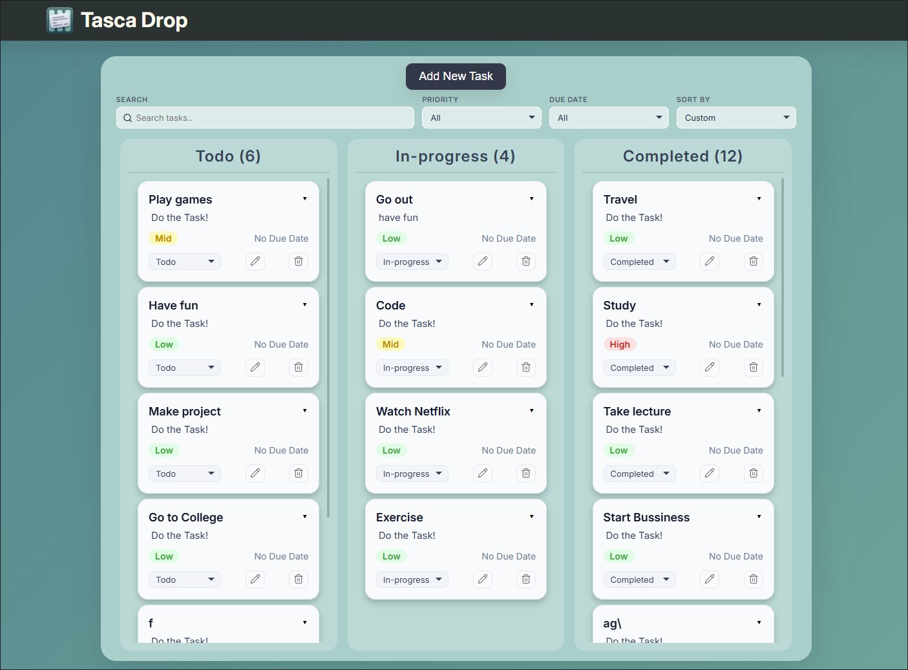

# TascaDrop — Drag. Drop. Done.

A fast, minimal kanban task manager. Create tasks, set priorities, track progress — drag and drop between columns on both desktop and mobile.

TascaDrop does not use any drag-and-drop or gesture library. The entire drag-and-drop system was implemented from scratch using native browser APIs and JavaScript event handling.
The implementation supports both mouse and touch interactions. I avoided external drag-and-drop libraries to understand how these work at a lower level.

**[Live Demo →](https://tascadrop.netlify.app)**



---

## Features

**Main**
- Three-column kanban board — Todo, In-progress, Completed
- Create, edit, and delete tasks with confirmation
- Priority levels — High, Mid, Low with color-coded badges
- Due dates with smart filtering
- Task descriptions with expand/collapse on click
- Created date tracking

**Search & Filters**
- Live search with highlight matching
- Filter by priority
- Filter by due date — Overdue, Due Today, Due Tomorrow, Later, No Due Date
- Sort by Date Created, Due Date (Earliest/Latest), Priority (High/Low)
- Custom drag order preserved across sessions

**Drag & Drop**
- Drag cards between columns on desktop and mobile
- Auto-scroll while dragging
- Auto-swipe between columns on mobile while dragging
- Skeleton placeholder shows drop position
- Pagination with Load More — auto-loads on drag to bottom

**Mobile**
- Fully responsive — single column view with swipe gestures
- Floating action button (+) for adding tasks
- Touch-optimized drag and drop

**Production**
- localStorage persistence — tasks survive page refresh
- PostHog analytics with custom events
- Feedback form via Google Forms
- Open Graph meta tags for social sharing
- Favicon and icons

---

## Tech Stack

- HTML5 (semantic)
- CSS3 (custom, no framework)
- Vanilla JavaScript (ES Modules)
- Lucide Icons
- Inter (Google Fonts)
- PostHog Analytics
- Deployment on Netlify

No build tools. No framework. Just the platform.

---

## Getting Started
 
No installation or build step required.
 
```bash
# Clone the repo
git clone https://github.com/abdullahghazi-swe/Task-Manager.git
 
# Open in browser
cd tascadrop
open index.html
```

---
 
## How to Use
 
**Creating a task**
Click "Add New Task" (desktop) or the `+` button (mobile) → fill in the title, priority, due date, and description → click "Create Task".
 
**Moving tasks**
Use the status dropdown on each card, or drag and drop the card to another column.
 
**Expanding a task**
Click anywhere on a card (except buttons) to expand it and see the full description and created date.
 
**Searching and filtering**
Use the search bar to find tasks by title or description. Use the Priority, Due Date, and Sort By dropdowns to filter and sort.
 
**Drag and drop on mobile**
Press and hold a card for ~300ms, then drag to another column. Drag to the left or right edge to auto-swipe between columns.

**Auto-scroll**
Drag to top or bottom of a column to auto-scroll.
 
---
 
## Keyboard Shortcuts
 
| Shortcut | Action |
|----------|--------|
| `Enter` | Submit the create/edit task form |
| `Escape` | Close the modal |

---

## Feedback
 
Found a bug or have a feature request? [Submit feedback here →](https://docs.google.com/forms/d/e/1FAIpQLScOFJlU353v0cN-5CkupIzLekR9zZVva_yzA01EgPGLXuicrA/viewform)
 
---

## Author

**Abdullah Ghazi** <br>
GitHub: https://github.com/abdullahghazi-swe <br>
LinkedIn: https://www.linkedin.com/in/abdullah-ghazi-swe/
